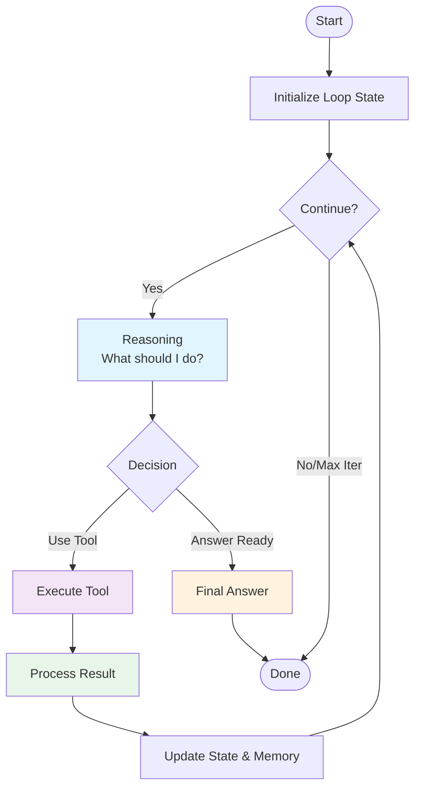
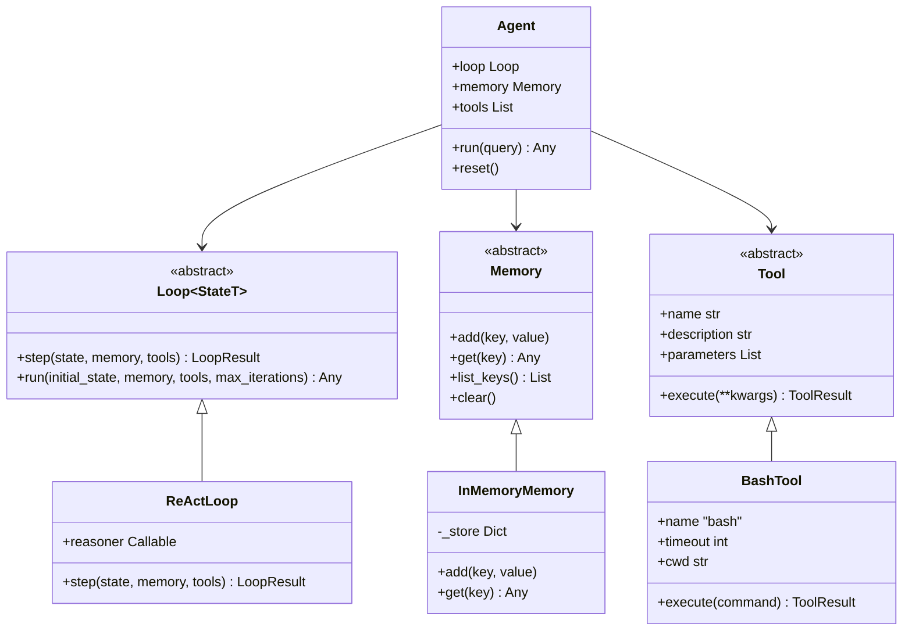
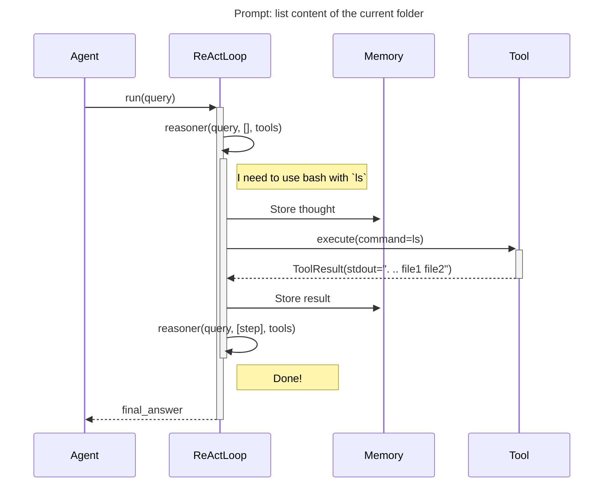
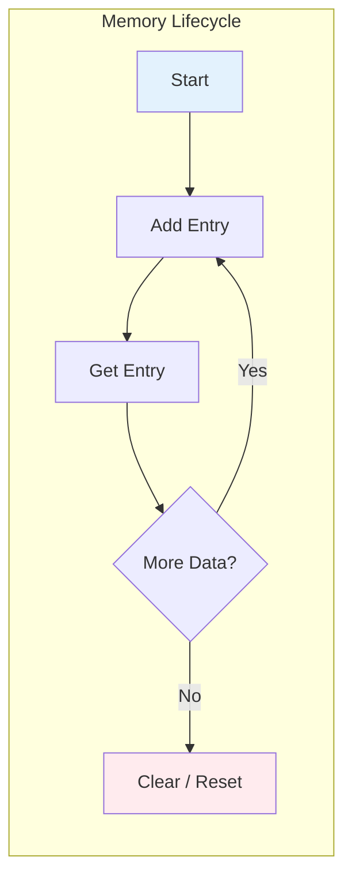
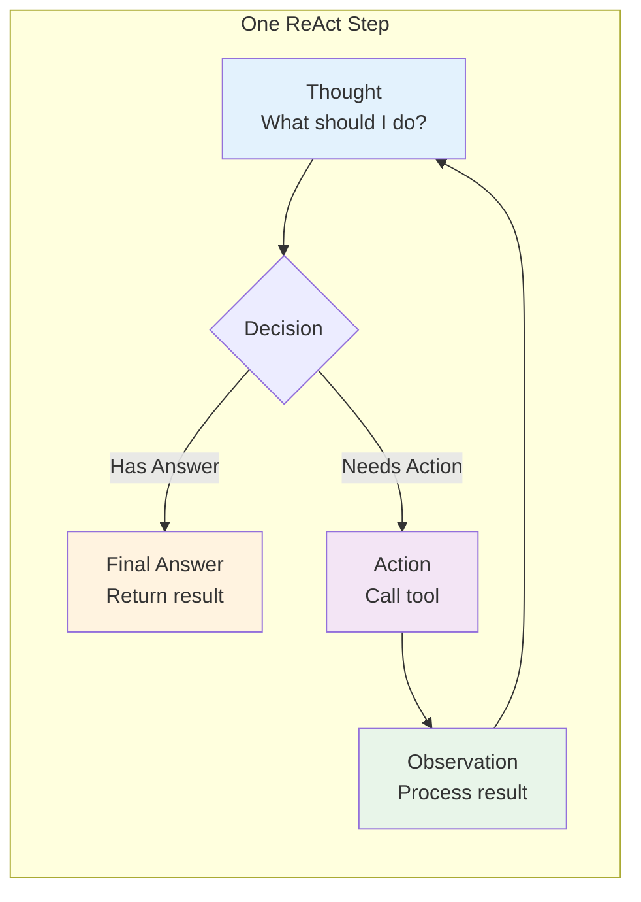

# Agentic Loops

[](https://github.com/misza222/simpla_loop/actions/workflows/ci.yml)
[](https://www.python.org/downloads/)
[](https://github.com/astral-sh/ruff)

An educational Python framework for understanding and experimenting with **agentic loop patterns**. Built with clean abstractions, comprehensive documentation, and real implementations you can study and extend.

## What Are Agentic Loops?

Agentic loops are the core mechanism that enables AI agents to:
1. **Think** - Reason about a problem
2. **Act** - Execute tools to gather information or make changes
3. **Observe** - Process the results
4. **Repeat** - Continue until the task is complete



## Architecture

The framework follows a layered architecture with clear separation of concerns:



## Quick Start

### Installation

```bash
# Clone and install
git clone <repository>
cd simple-loop
pip install -e .
```

### Configuration

Create a `.env` file with your OpenAI API key:

```bash
cp .env.example .env
# Edit .env and add: OPENAI_API_KEY=sk-your-key-here
```

### Basic Usage

```python
from simpla_loop import Agent, AgentConfig
from simpla_loop.llm import create_react_reasoner
from simpla_loop.loops.react import ReActLoop
from simpla_loop.memory.in_memory import InMemoryMemory
from simpla_loop.tools.bash import BashTool

# Create LLM-powered reasoner
reasoner = create_react_reasoner()

# Create agent
agent = Agent(
    loop=ReActLoop(reasoner=reasoner),
    memory=InMemoryMemory(),
    tools=[BashTool()],
    config=AgentConfig(debug=True)
)

# Run it
result = agent.run("List files in the current directory")
print(result)
```

## Core Concepts

### 1. Loop (The Strategy)

The **Loop** defines *how* an agent thinks and acts. Different strategies suit different problems:

| Loop Type | Pattern | Best For |
|-----------|---------|----------|
| **ReAct** | Thought → Action → Observation | Multi-step reasoning, tool use |
| Plan-and-Solve | Plan → Execute → Verify | Complex, structured tasks |
| Reflexion | Act → Evaluate → Improve | Self-improvement, learning |



### 2. Memory (The Context)

**Memory** persists information across loop iterations. The simple `InMemoryMemory` uses a dictionary:

```python
from simpla_loop.memory.in_memory import InMemoryMemory

memory = InMemoryMemory()
memory.add("user_query", "What's the weather?")
memory.add("step_1_result", {...})

# Later in the loop...
query = memory.get("user_query")
```



### 3. Tool (The Capability)

**Tools** are the agent's interface to the outside world. Each tool is self-describing:

```python
from simpla_loop.tools.bash import BashTool
from simpla_loop.core.tool import ToolParameter

tool = BashTool(timeout=30)

print(tool.name)           # "bash"
print(tool.description)    # "Execute bash shell commands..."
print(tool.parameters)     # [ToolParameter(name="command", required=True)]

# Execute
result = tool.execute(command="ls -la")
if result.success:
    print(result.data.stdout)
```

### 4. ReAct Pattern

The **ReAct** (Reasoning + Acting) loop is implemented as:



```python
from simpla_loop.loops.react import ReActLoop, ReActState, ReActStep

# The reasoner returns a dict with:
# - thought: What am I thinking?
# - action: Which tool to use (optional)
# - action_input: Tool arguments (optional)
# - final_answer: The answer (if done)

def reasoner(query, steps, tools):
    return {
        "thought": "I should search for this",
        "action": "web_search",
        "action_input": {"query": query}
    }
```

## LLM Integration

The framework uses [Instructor](https://python.useinstructor.com/) for structured LLM outputs with OpenAI-compatible APIs. This provides type-safe, validated responses with automatic retries.

### Configuration

Set your OpenAI API key in `.env`:

```bash
OPENAI_API_KEY=sk-your-api-key-here
OPENAI_BASE_URL=https://api.openai.com/v1  # Optional: for custom gateways
OPENAI_MODEL=gpt-4o-mini                    # Optional: default model
OPENAI_MAX_RETRIES=3                        # Optional: validation retries
```

### Usage

```python
from simpla_loop import Agent, AgentConfig
from simpla_loop.llm import create_react_reasoner
from simpla_loop.loops.react import ReActLoop
from simpla_loop.memory.in_memory import InMemoryMemory
from simpla_loop.tools.bash import BashTool

# Create LLM-powered reasoner (loads from .env by default)
reasoner = create_react_reasoner(
    model="gpt-4o-mini",      # Or use env var
    max_retries=3,            # Retries on validation failure
)

# Build the agent
agent = Agent(
    loop=ReActLoop(reasoner=reasoner),
    memory=InMemoryMemory(),
    tools=[BashTool(timeout=30)],
    config=AgentConfig(debug=True)
)

# Run with natural language
result = agent.run("List all Python files in the current directory")
print(result)
```

### How It Works

```mermaid
sequenceDiagram
    participant Agent
    participant Reasoner as LLM Reasoner
    participant Instructor
    participant OpenAI

    Agent->>Reasoner: reasoner(query, steps, tools)
    Reasoner->>Reasoner: Build prompt with history
    Reasoner->>Instructor: chat.completions.create(
        response_model=ReActResponse
    )
    Instructor->>OpenAI: API call with schema
    OpenAI-->>Instructor: JSON response
    Instructor->>Instructor: Validate against ReActResponse
    alt Invalid
        Instructor->>OpenAI: Retry with error feedback
    end
    Instructor-->>Reasoner: ReActResponse object
    Reasoner-->>Agent: Dict with thought/action
```

### Features

- **Structured Outputs**: Uses Pydantic models for type-safe responses
- **Automatic Validation**: Instructor validates and retries on schema failures
- **Custom Gateways**: Supports custom OpenAI-compatible endpoints
- **No Streaming**: Simple synchronous API for predictability

## Project Structure

```
simpla_loop/
├── src/simpla_loop/          # Main package
│   ├── core/                   # Abstract interfaces
│   │   ├── loop.py            # Loop base class
│   │   ├── memory.py          # Memory base class
│   │   └── tool.py            # Tool base class
│   ├── llm/                    # LLM integration (optional)
│   │   ├── client.py          # OpenAI/Instructor client
│   │   ├── models.py          # Pydantic response models
│   │   └── reasoners.py       # LLM reasoner factory
│   ├── loops/                  # Loop implementations
│   │   └── react.py           # ReAct loop
│   ├── memory/                 # Memory implementations
│   │   └── in_memory.py       # Dictionary-based memory
│   ├── tools/                  # Tool implementations
│   │   └── bash.py            # Bash execution tool
│   ├── agent.py               # High-level Agent API
│   └── __init__.py
├── tests/                      # Test suite
│   ├── conftest.py
│   ├── test_llm.py            # LLM module tests
│   ├── test_memory.py
│   ├── test_tools.py
│   └── test_react_loop.py
├── examples/                   # Usage examples
│   └── llm_agent_example.py   # LLM-powered agent demo
├── .env.example               # Configuration template
```

## Development

### Running Tests

```bash
# Run all tests
pytest

# With coverage
pytest --cov=simpla_loop --cov-report=html

# Specific test file
pytest tests/test_react_loop.py -v
```

### Pre-commit Hooks

The project uses [pre-commit](https://pre-commit.com/) to run automated checks before each commit. Install the hooks after cloning:

```bash
pip install -e ".[dev]"
pre-commit install
```

The following hooks run automatically on `git commit`:

| Hook | Purpose |
|------|---------|
| `check-ast` | Validates Python syntax |
| `check-merge-conflict` | Detects unresolved merge conflict markers |
| `check-yaml` / `check-toml` / `check-json` | Validates config file syntax |
| `check-added-large-files` | Blocks files larger than 500 KB |
| `trailing-whitespace` | Strips trailing whitespace |
| `end-of-file-fixer` | Ensures files end with a newline |
| `detect-secrets` | Prevents accidental secret commits |
| `ruff` | Lints and auto-fixes Python code |
| `ruff-format` | Formats Python code |
| `pylint-similarity` | Flags duplicate code blocks (≥ 6 lines) |

To run all hooks manually against the entire codebase:

```bash
pre-commit run --all-files
```

### Code Quality

```bash
# Formatting
ruff format .

# Linting
ruff check . --fix

# Type checking
mypy src/simpla_loop
```

### Adding a New Tool

```python
from simpla_loop.core.tool import Tool, ToolParameter, ToolResult

class CalculatorTool(Tool):
    @property
    def name(self) -> str:
        return "calculator"

    @property
    def description(self) -> str:
        return "Perform arithmetic calculations"

    @property
    def parameters(self) -> list[ToolParameter]:
        return [
            ToolParameter(
                name="expression",
                type="string",
                description="Math expression to evaluate",
                required=True
            )
        ]

    def execute(self, **kwargs) -> ToolResult:
        expression = kwargs.get("expression", "")
        try:
            result = eval(expression)  # In production, use a safer evaluator!
            return ToolResult.ok(result)
        except Exception as e:
            return ToolResult.fail(str(e))
```

### Adding a New Loop

```python
from dataclasses import dataclass
from simpla_loop.core.loop import Loop, LoopResult

@dataclass
class MyState:
    query: str
    counter: int = 0

class MyLoop(Loop[MyState]):
    def step(self, state: MyState, memory, tools) -> LoopResult[MyState]:
        # Your logic here
        state.counter += 1

        if state.counter >= 3:
            return LoopResult(state=state, done=True, output="Done!")

        return LoopResult(state=state, done=False, output=None)
```

## Design Principles

1. **Educational Clarity**: Every concept is isolated and well-documented
2. **Extensibility**: Easy to add new loops, memory types, and tools
3. **Testability**: Explicit state, no hidden dependencies, easy to mock
4. **Type Safety**: Full type annotations throughout
5. **Minimal Dependencies**: Core package has no external dependencies

## Further Reading

- [ReAct Paper](https://arxiv.org/abs/2210.03629) - The original ReAct research
- [Lilian Weng's Blog](https://lilianweng.github.io/posts/2023-06-23-llm-agent/) - LLM Powered Autonomous Agents
- [docs/concepts.md](docs/concepts.md) - Extended conceptual documentation

## License

MIT License — See LICENSE file for details.

## Contributing

This is an educational project. Contributions that improve clarity, add examples, or implement additional loop patterns are welcome!
